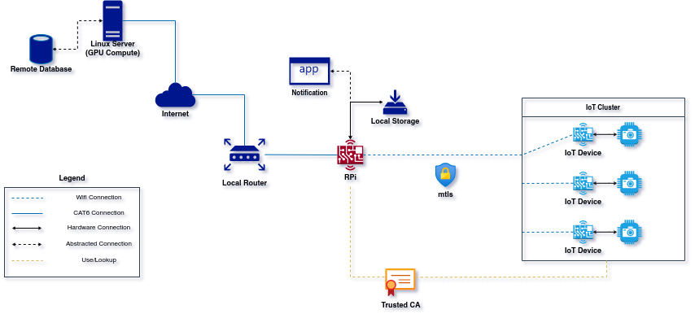
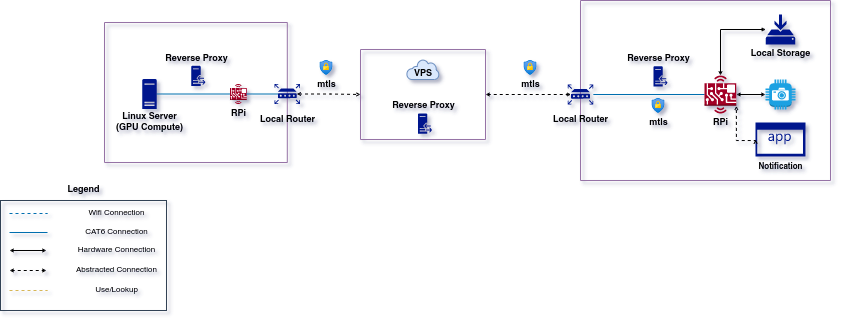

# Project Dump
A place which homes project ideas that spawn in my head.

## Homeland Watcher
Bunch of IoT devices with cameras to monitor, record, and classify objects with
an environment.

**Technical Problems**:
- Data Gathering (`data`)
- Data Encryption (`security`)
- Classification (`ai`, `ml`)
- Cloud Compute (`compute`, `cloud`)
- Smart Recording (`algorithm`, `compression`)

**Diagram v1**

  

**Diagram v2**

  

# License
This is licensed under [GNU GPLv3](LICENSE).
